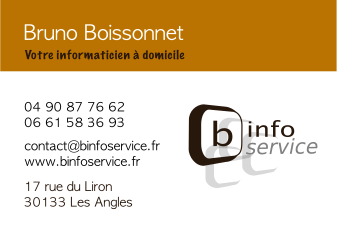

# Carte-De-Visite

Travail sur la carte de visite de B Info Service.

## Prérequis

Toutes les cartes de visite ont été créés à l'aide du logiciel [Inkscape](https://inkscape.org) qui permet de créer des images vectorielles (fichiers .svg).

## Impression

### Recommandations

- Ajouter 5 mm de bords perdus sur chaque côté pour les impressions sans contour blanc.
- Ne pas placer les textes à moins de 3 mm du bord du document.
- Travaillez directement au format final du projet (bords perdus inclus). Exemple : pour un A4 format 210 x 297 mm, fournir un fichier 220 x 307 mm.
- Les images doivent avoir une résolution de 300 dpi (pixels par pouces).
- Pour imprimer un document sans contour blanc, il faut laisser les fonds colorés et les photos dépasser du format final de 5 mm sur chaque côté.
- Enregistrez le document en PDF vectoriel

### Exemple de format d'impression

- Découpe : Coins arrondis;
- Délai : Rapide;
- Format : 8,5x5,5 cm (Format standard);
- Impression : Recto;
- Pelliculage : Mat Soft Touch Recto;
- Quantité : 250 ex;
- Support : Papier Satimat (Couché demi mat - 350 gr);
- Vernis sélectif : Sans ;

## Versions

Nous utilisons [SemVer](http://semver.org/) pour le versionnement. Pour les versions diponibles, voir les [tags sur ce dépôt](https://github.com/BInfoService/Carte-De-Visite/tags). 

## Auteur

* **Bruno Boissonnet** - [Boissonnfive](https://github.com/boissonnfive)

